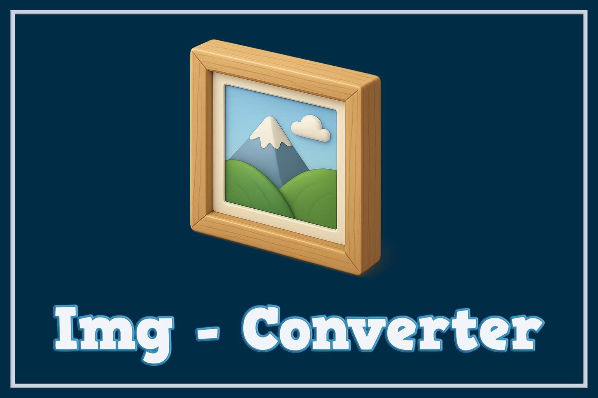

# 🖼️ Image Converter — Desktop App (Python)

---
<p align="center">
  
  
  
  
  
  
</p>
---

**Image Converter** es una aplicación de escritorio desarrollada en **Python** que permite convertir imágenes entre múltiples formatos de forma rápida, segura y sencilla, mediante una **interfaz gráfica moderna** basada en **Tkinter** y **Pillow (PIL)**.

El proyecto está diseñado con un enfoque claro en la **experiencia de usuario (UX)**, la **estabilidad de la aplicación**, el **manejo correcto de recursos** y la **compatibilidad para distribución como ejecutable** usando PyInstaller.

---



---

## ✨ Características principales

* 📂 Selección sencilla de imágenes desde el explorador de archivos
* 👁️ Vista previa de la imagen en tiempo real
* 🔄 Conversión entre múltiples formatos:

  * JPG / JPEG
  * PNG
  * WEBP
  * BMP
  * GIF
* ⚙️ Ajustes automáticos según el formato de salida
* 🚀 Conversión en **hilo secundario** (no bloquea la interfaz gráfica)
* 🧠 Manejo de errores y advertencias personalizadas
* 🎨 Interfaz gráfica estilizada y consistente
* ⌨️ Atajos de teclado integrados
* 📦 Preparada para compilarse como ejecutable (.exe) con PyInstaller

---

## 🧰 Tecnologías utilizadas

* **Python 3**
* **Tkinter** — Interfaz gráfica de usuario
* **Pillow (PIL)** — Procesamiento y conversión de imágenes
* **Threading** — Ejecución de procesos en segundo plano
* **PyInstaller** — Empaquetado como ejecutable
* **OS / SYS** — Manejo de rutas y recursos

---

## 🖥️ Interfaz de usuario

La aplicación incluye:

* Ventana principal centrada automáticamente
* Área de vista previa interactiva para la imagen cargada
* Menú desplegable personalizado para selección de formato
* Botones gráficos con imágenes y efectos visuales
* Ventanas emergentes personalizadas para advertencias e información
* Identidad visual coherente (colores, tipografía y estilo)

---

## 📷 Capturas de pantalla

<p align="center">
  
</p>

---

## ⌨️ Atajos de teclado

| Tecla  | Acción                 |
| ------ | ---------------------- |
| Enter  | Convertir imagen       |
| Delete | Limpiar imagen cargada |

---

## 🚀 Instalación y uso

### 🔹 Opción 1 — Ejecutar desde el código fuente

1. Clona el repositorio:

   ```bash
   git clone https://github.com/tu-usuario/image-converter.git
   cd image-converter
   ```

2. Instala las dependencias necesarias:

   ```bash
   pip install pillow
   ```

3. Ejecuta la aplicación:

   ```bash
   python main.py
   ```

---

### 🔹 Opción 2 — Crear ejecutable con PyInstaller

```bash
pyinstaller --onefile --windowed --add-data "images;images" main.py
```

> El método `resource_path()` garantiza compatibilidad tanto en entorno de desarrollo como en el ejecutable final.

---

## 📁 Estructura del proyecto

```text
image-converter/
│
├── main.py
├── images/
│   ├── icon.ico
│   ├── boton.png
│   └── robot.png
└── README.md
```

---

## 🧠 Detalles técnicos destacados

* Uso de `threading.Thread` para evitar congelamiento de la interfaz gráfica
* Gestión de estados para prevenir acciones concurrentes durante la conversión
* Conversión segura de imágenes con transparencia (RGBA → RGB)
* Optimización específica por formato de salida
* Manejo correcto de rutas para PyInstaller (`_MEIPASS`)
* Separación clara entre lógica de negocio, interfaz y eventos

---

## 👨‍💻 Autor

*   **Nombre:** Pablo Téllez
*   **Contacto:** pharmakoz@gmail.com

📍 **Tarija, Bolivia — 2025**


---

## 📜 Licencia

Este proyecto se distribuye bajo la licencia **MIT**.

Eres libre de usar, modificar y distribuir este software.

---

⭐ Si este proyecto te resulta útil, considera dejar una estrella en el repositorio.
